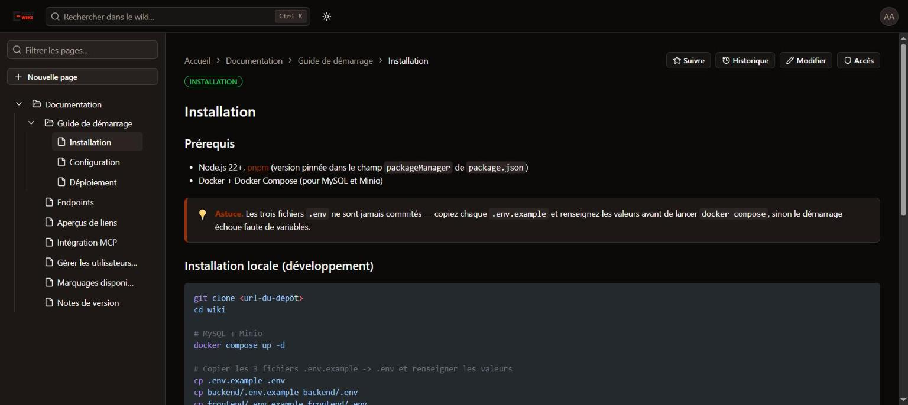
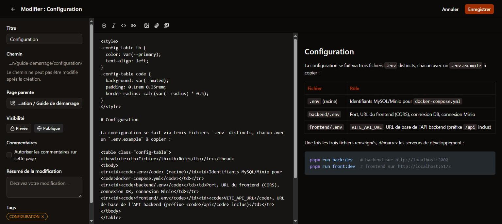
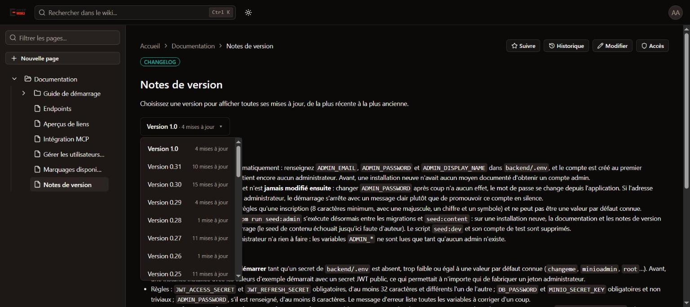

<p align="center">
  
</p>

<p align="center">
  A self-hosted, collaborative wiki for teams — page tree, full version history, granular permissions, and an MCP server so AI assistants can read and write your knowledge base.
</p>

<p align="center">
  <a href="LICENSE"></a>
  <a href="https://github.com/FireDroX/nestwiki/actions/workflows/ci.yml"></a>
  <a href="CHANGELOG.md"></a>
</p>



## Features

- **Page tree** — nest pages as deep as you need, move them around, address every page by its full path (`/pages/docs/guides/install`).
- **Markdown editor with live preview** — GFM tables, syntax-highlighted code, LaTeX math, Mermaid diagrams, GitHub-style callouts, heading anchors with an automatic table of contents, and sanitized raw HTML with page-scoped `<style>` for richer layouts.
- **Append-only version history** — every save is a new version; compare any two versions and restore an old one without losing anything.
- **Real-time collaboration** — live updates of the page tree and comments, plus automatic merging when two people edit the same page.
- **Permissions that scale** — `admin` / `member` roles, groups, global permissions (`user.manage`, `media.upload`…) and per-page access rules that can cover a whole subtree, with exclusions. Pages are public or private.
- **Search** — full-text search across titles and content, filtered by what each reader is allowed to see.
- **Media library** — images and files stored in any S3-compatible object storage, served through short-lived presigned URLs, with in-page PDF previews.
- **Comments and tags** on every page.
- **MCP server** — let Claude or any MCP-compatible assistant search, read and edit the wiki with the permissions of the user it acts for, via API keys or OAuth 2.0.
- **Link previews** — rich Open Graph and Discord cards for public pages.
- **Administration** — users, groups, system settings, admin audit log and user activity log.
- **Security by default** — refuses to start with weak or default secrets, account lockout after repeated failed logins, breached-password checks, optional Cloudflare Turnstile on sign-up and login.
- **English and French** user interface, light and dark themes.



## Quick start (Docker)

You need Docker with Docker Compose. This starts MySQL, an S3-compatible object store ([RustFS](https://rustfs.com)), the API and the web app.

```bash
git clone https://github.com/FireDroX/nestwiki.git
cd nestwiki
cp .env.example .env
cp backend/.env.example backend/.env
cp frontend/.env.example frontend/.env
```

Fill in the values (see [Configuration](#configuration)). Generate every secret with:

```bash
openssl rand -hex 32
```

For this all-in-one setup, `backend/.env` must point at the Compose services: `DB_HOST=mysql`, `MINIO_ENDPOINT=minio`, `DB_PASSWORD` equal to `MYSQL_ROOT_PASSWORD` and `MINIO_SECRET_KEY` equal to the one in `.env`. Then:

```bash
docker compose up -d --build
```

Open <http://localhost:8080> and sign in with the `ADMIN_EMAIL` / `ADMIN_PASSWORD` you configured. On first start the backend applies the database migrations, creates that admin account, and seeds the built-in documentation and release notes.

## Configuration

There are three `.env` files, each with a commented `.env.example` next to it.

**`.env` (repository root)** — read by Docker Compose only.

| Variable | Description |
| --- | --- |
| `MYSQL_ROOT_PASSWORD` | Root password of the bundled MySQL container. |
| `MYSQL_DATABASE` | Database created on first start (`nestwiki`). |
| `MINIO_ACCESS_KEY`, `MINIO_SECRET_KEY` | Credentials of the bundled object storage. |
| `VITE_API_URL` | Public URL of the API as seen by browsers, e.g. `https://wiki.example.com/api`. Baked into the web app at build time. |
| `VITE_TURNSTILE_SITE_KEY` | Optional Cloudflare Turnstile site key for the sign-up and login forms. |

**`backend/.env`** — the API.

| Variable | Description |
| --- | --- |
| `PORT` | HTTP port of the API (`3000`). |
| `FRONTEND_URL` | Public origin of the web app, allowed by CORS. |
| `DB_HOST`, `DB_PORT`, `DB_USERNAME`, `DB_PASSWORD`, `DB_DATABASE` | MySQL 8 connection. |
| `JWT_ACCESS_SECRET`, `JWT_REFRESH_SECRET` | Token signing secrets: at least 32 characters each, different from each other. |
| `ADMIN_EMAIL`, `ADMIN_PASSWORD`, `ADMIN_DISPLAY_NAME` | First admin account, created only while the database has no admin. Never modified afterwards: change the password from the app. |
| `MINIO_ENDPOINT`, `MINIO_PORT`, `MINIO_USE_SSL`, `MINIO_ACCESS_KEY`, `MINIO_SECRET_KEY`, `MINIO_BUCKET` | S3-compatible storage used for media. The bucket is created on start if missing. |
| `MINIO_PUBLIC_ENDPOINT`, `MINIO_PUBLIC_PORT`, `MINIO_PUBLIC_USE_SSL` | Optional public host used to sign media URLs when `MINIO_ENDPOINT` is only reachable inside Docker. |
| `TURNSTILE_SITE_KEY`, `TURNSTILE_SECRET_KEY` | Optional Cloudflare Turnstile keys. |
| `UPDATE_CHECK` | Set to `false` to stop checking GitHub for new releases (see [Updating](#updating)). |

**`frontend/.env`** — the web app in development: `VITE_API_URL` (e.g. `http://localhost:3000/api`) and the optional `VITE_TURNSTILE_SITE_KEY`.

> **Secrets are checked at startup.** The API refuses to start while `JWT_ACCESS_SECRET`, `JWT_REFRESH_SECRET`, `DB_PASSWORD` or `MINIO_SECRET_KEY` is missing, too short or a well-known default (`changeme`, `minioadmin`, `root`…), and lists every variable to fix in one message. For local development only, `DEV=true` in `backend/.env` skips these checks.

## Updating

```bash
git pull
docker compose up -d --build
```

Migrations run automatically when the backend container starts.

Admins are told when a newer release exists: the API asks GitHub's public API for the latest NestWiki release (at most every 6 hours, nothing about your instance is sent) and the web app shows a notice to administrators until they update or ignore that version. Set `UPDATE_CHECK=false` in `backend/.env` to disable this outbound request. Read the [changelog](CHANGELOG.md) before upgrading: entries flagged with ⚠️ need an action on your side. Pre-built images are also published as `ghcr.io/firedrox/nestwiki-backend` and `ghcr.io/firedrox/nestwiki-frontend`, tagged `latest`, `X.Y` and `X.Y.Z`.



## Development

Requirements: Node.js 22+, [pnpm](https://pnpm.io) (version pinned in `package.json`), Docker.

```bash
pnpm install
docker compose up -d mysql minio      # database and object storage only
cd backend
pnpm run migration:run
pnpm run seed:admin                   # first admin from ADMIN_* (also done on start)
pnpm run seed:content                 # built-in documentation and release notes
cd ..
pnpm run back:dev                     # API on http://localhost:3000 (Swagger at /api/docs)
pnpm run front:dev                    # web app on http://localhost:5173
```

Tests: `pnpm --filter backend run test`, `pnpm --filter backend run test:e2e` (needs MySQL and the object storage) and `pnpm --filter frontend run test`.

## Documentation

- In-app documentation (installation, configuration, permissions, MCP, link previews) is seeded into every instance under **Documentation**.
- [Technical specification](docs/technical-spec.md) — architecture, data model and the full list of API endpoints (in French).
- [Continuous deployment example](docs/deployment.md) — how the demo instance is deployed with GitHub Actions and a Cloudflare Tunnel (in French).
- [Changelog](CHANGELOG.md).

## Contributing

Contributions are welcome: read [CONTRIBUTING.md](CONTRIBUTING.md) and the [code of conduct](CODE_OF_CONDUCT.md). To report a vulnerability, follow [SECURITY.md](SECURITY.md) instead of opening a public issue.

## License

Copyright © 2026 FireDroX. NestWiki is free software, released under the [GNU Affero General Public License v3.0](LICENSE): if you run a modified version as a network service, you must make its source code available to its users.

NestWiki is an independent project and is not affiliated with or endorsed by the NestJS project.
